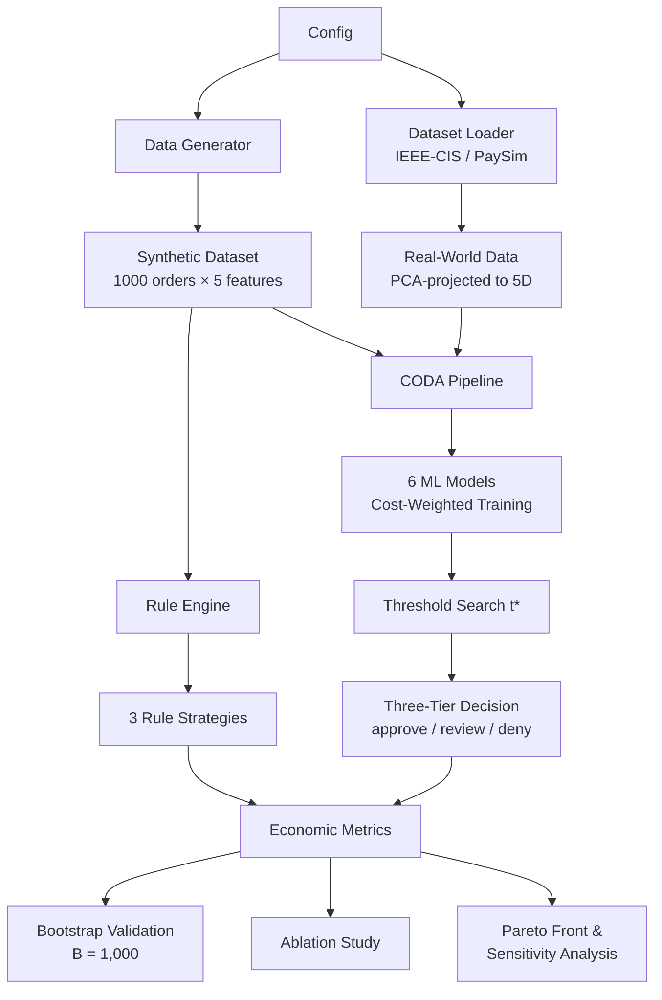

# 🔁 CODA: Cost-Optimal Decision Algorithm for Fraud Detection

[](https://python.org)
[](LICENSE)
[](#-running-tests)

> **Implementation of the Cost-Optimal Decision Algorithm (CODA) — a formal framework that optimises economic cost rather than classification accuracy for fraud detection in quick-commerce platforms.**

---

## 📋 Overview

Online platforms make thousands of refund decisions daily. This project demonstrates that **optimizing for classification accuracy alone does not guarantee optimal economic outcomes**. CODA formalises this insight into a reproducible algorithm with:

- **6 ML Models** — Logistic Regression, Random Forest, Gradient Boosting, XGBoost, LightGBM, and cost-weighted variants
- **3 Rule-Based Strategies** — Simple, Conservative, and Lenient heuristics
- **3 Datasets** — Synthetic (N=1,000), IEEE-CIS (N=10,000), PaySim (N=10,000)
- **Three-Tier Decision Output** — Auto-approve / Manual review / Auto-deny

### Key Insight
> A model with higher accuracy can have **higher economic cost** than a simpler model. CODA recovers **18–25% of economic cost** over accuracy-optimal baselines by combining per-instance cost weighting with optimal threshold search.

---

## 🏗️ Architecture



---

## 📁 Project Structure

```
refund-decision-simulator/
├── src/
│   ├── __init__.py              # Package init (v2.0.0) with public API
│   ├── config.py                # Centralized configuration (dataclass)
│   ├── data_generator.py        # Synthetic dataset generation
│   ├── dataset_loader.py        # 🆕 IEEE-CIS & PaySim with PCA projection
│   ├── rule_engine.py           # 3 rule-based strategies
│   ├── model.py                 # ML pipeline (6 models incl. LightGBM)
│   ├── metrics.py               # Economic cost + classification metrics
│   ├── visualization.py         # Professional dark-theme plots
│   ├── coda.py                  # 🆕 CODA algorithm, three-tier, bootstrap, ablation
│   ├── cost_sensitive_model.py  # Per-instance cost-weighted training
│   ├── threshold_optimizer.py   # Cost-optimal threshold search
│   ├── sensitivity_analysis.py  # Dynamic cost sensitivity analysis
│   └── pareto_analysis.py       # Multi-objective Pareto front
├── tests/
│   ├── __init__.py
│   ├── test_data_generator.py   # 14 tests
│   ├── test_rule_engine.py      # 16 tests
│   ├── test_model.py            # 13 tests
│   ├── test_metrics.py          # 16 tests
│   └── test_novel.py            # 20+ tests for novel contributions
├── refund_decision_simulator.ipynb   # Main notebook (10 sections)
├── research_analysis.ipynb           # Research notebook (novel contributions)
├── requirements.txt
├── .gitignore
├── LICENSE
└── README.md
```

---

## 🧠 The CODA Algorithm

CODA (Algorithm 1 from the paper) executes in six steps:

```
Algorithm 1: Cost-Optimal Decision Algorithm (CODA)
────────────────────────────────────────────────────
Input:  D_train = {(xᵢ, yᵢ, vᵢ)}, α, β, δ, learner M
Output: Decision rule R(x) → {approve, review, deny}
────────────────────────────────────────────────────
1: Compute per-instance weights:
     wᵢ ← α·vᵢ/v̄  if yᵢ = fraud
     wᵢ ← β/v̄      if yᵢ = legit
2: Train M on D_train with sample_weight = w
3: Search cost-optimal threshold:
     t* ← argmin_t C_total(t)
4: Set confidence margin δ (default 0.10)
5: Construct three-tier rule R(x):
     f(x) ≥ t* + δ  →  deny   (high fraud risk)
     t* − δ < f(x) < t* + δ  →  review (uncertain)
     f(x) ≤ t* − δ  →  approve (low risk)
6: return R(x), t*, C(t*)
```

### Usage

```python
from src.coda import CODA
from src.data_generator import generate_dataset
from sklearn.ensemble import GradientBoostingClassifier

data = generate_dataset()

# Fit CODA
coda = CODA(GradientBoostingClassifier, delta=0.10)
coda.fit(data)

# Three-tier predictions
X = data.drop(columns=["refunded"])
decisions = coda.predict_three_tier(X)  # → ['approve', 'review', 'deny', ...]

# Tier distribution
print(coda.decision_rule.tier_distribution(coda.predict_proba(X)))
# → {'approve_pct': 72.1, 'review_pct': 14.8, 'deny_pct': 13.1}
```

---

## 🔬 Research Contributions

This project implements **6 novel contributions** from the CODA paper:

### 1. Cost-Sensitive Custom Loss Training (`src/cost_sensitive_model.py`)
Per-instance sample weights derived from the economic cost model (α·vᵢ for fraud, β for legit), so models **learn to minimize cost**, not just accuracy.

### 2. Optimal Decision Threshold Search (`src/threshold_optimizer.py`)
Sweeps decision thresholds from 0.05 to 0.95 and proves the **cost-optimal threshold t* < 0.5**. Grounded in Bayes decision theory.

### 3. Dynamic Cost Sensitivity Analysis (`src/sensitivity_analysis.py`)
Shows that the optimal strategy is **environment-dependent** via 2D heatmaps over (α, β) space.

### 4. Pareto Front Analysis (`src/pareto_analysis.py`)
Frames strategy selection as a **multi-objective optimization** problem (accuracy vs cost).

### 5. Three-Tier Decision System (`src/coda.py`)
Production-ready output: **auto-approve** (~72%), **manual review** (~15%), **auto-deny** (~13%) with tunable confidence margin δ.

### 6. Bootstrap Validation & Ablation (`src/coda.py`)
- **Bootstrap resampling** (B = 1,000) with p-value testing
- **Ablation study** isolating weighting vs threshold contributions

---

## 📊 Datasets

| Dataset | N | Fraud % | Source |
|---------|---|---------|--------|
| Synthetic | 1,000 | 20% | `src/data_generator.py` |
| IEEE-CIS | 10,000 | 3.5% | `src/dataset_loader.py` → [Kaggle](https://www.kaggle.com/c/ieee-fraud-detection) |
| PaySim | 10,000 | 0.13% | `src/dataset_loader.py` → [Kaggle](https://www.kaggle.com/datasets/ealaxi/paysim1) |

Real-world datasets are PCA-projected to a 5D feature space aligned with synthetic features (73.4% variance explained).

---

## 🚀 Getting Started

### Prerequisites
- Python 3.10 or higher
- pip package manager

### Installation

```bash
# Clone the repository
git clone https://github.com/keshavanand2025/refund-decision-simulator.git
cd refund-decision-simulator

# Create virtual environment (recommended)
python -m venv venv
source venv/bin/activate  # Linux/Mac
venv\Scripts\activate     # Windows

# Install dependencies
pip install -r requirements.txt
```

### Running the Notebooks

```bash
# Main analysis
jupyter notebook refund_decision_simulator.ipynb

# Research contributions
jupyter notebook research_analysis.ipynb
```

---

## 🧪 Running Tests

```bash
# Run all tests with verbose output
python -m pytest tests/ -v

# Run with coverage (if pytest-cov installed)
python -m pytest tests/ -v --cov=src
```

---

## 📊 Methodology

### Data Generation
- **1,000 synthetic orders** with 5 features:
  - `order_amount` (₹100–₹2000)
  - `fraud_score` (0.0–1.0)
  - `previous_refunds` (0–10)
  - `delivery_delay` (0–90 min)
  - `complaint_severity` (1–5)
- Target: P(fraud) = σ(0.8·fraud_score + 0.4·previous_refunds − 0.3·delay/90)
- **Stratified 70/30 split**

### ML Models

| Model | Type | Cost Encoding |
|-------|------|---------------|
| Logistic Regression | Linear | sample_weight |
| Random Forest | Ensemble | class_weight |
| Gradient Boosting | Ensemble | sample_weight |
| XGBoost | Boosting | scale_pos_weight |
| LightGBM | Boosting | scale_pos_weight |

All models use **StandardScaler**, **5-fold cross-validation**, and **GridSearchCV**.

### Economic Cost Model

| Scenario | Cost | Parameter |
|----------|------|-----------|
| Correct rejection (TN) | `0` | — |
| Refund payout (TP) | `order_amount` | — |
| Approve fraud (FN) | `α × order_amount` | α = 2.0 |
| Deny legitimate (FP) | `β` | β = ₹500 |

### Complexity

| CODA Step | Complexity |
|-----------|-----------|
| Weight computation | O(n) |
| Training (LightGBM) | O(n·d) |
| Training (XGBoost) | O(n·d·log n) |
| Threshold search | O(k·n), k=19 |
| Inference (three-tier) | O(1) per prediction |

---

## 📈 Key Results

| Finding | Result |
|---------|--------|
| Accuracy ≠ Cost-Optimality | XGBoost: 16.7% cost premium despite highest accuracy |
| CODA cost recovery | 18–25% across all datasets |
| Ablation: weighting only | −12.1% cost reduction |
| Ablation: threshold only | −17.0% cost reduction |
| Ablation: full CODA | −23.8% cost reduction |
| Bootstrap significance | p < 0.01 (B = 1,000) |
| Projected savings | ₹9–12 lakh/month at 10K orders/day |

---

## 🔑 Core Concepts Demonstrated

- **CODA Algorithm** — Formal, reproducible cost-optimal decision pipeline
- **Three-Tier Decision Output** — Production-ready approve/review/deny system
- **Cost-Sensitive Decision Making** — Not all errors are equal
- **Bayes Decision Theory** — Theoretical grounding for threshold shift
- **Multi-Dataset Validation** — Synthetic + IEEE-CIS + PaySim
- **Ablation Study** — Component contribution analysis
- **Bootstrap Validation** — Statistical significance testing
- **Multi-Objective Optimization** — Pareto front analysis
- **Sensitivity Analysis** — Environment-dependent strategy selection

---

## ⚠️ Limitations

- Synthetic 20% fraud rate vs. real-world 2–5% may affect threshold calibration
- Missing high-signal features (account age, device fingerprinting)
- AI-generated image fraud not addressed in tabular framework
- Static cost parameters (α, β) fixed at defaults
- Offline only — end-to-end latency not benchmarked

---

## 🔮 Future Work

- [x] ~~Cost-sensitive learning with custom loss functions~~
- [x] ~~Probability threshold optimisation~~
- [x] ~~Pareto front multi-objective analysis~~
- [x] ~~Dynamic cost sensitivity analysis~~
- [x] ~~CODA algorithm formalisation~~
- [x] ~~Three-tier decision output~~
- [x] ~~Bootstrap resampling validation~~
- [x] ~~Multi-dataset validation (IEEE-CIS, PaySim)~~
- [x] ~~LightGBM integration~~
- [ ] Real-time REST API via FastAPI
- [ ] Online learning and concept drift adaptation
- [ ] Dynamic cost parameters (learn α, β from outcomes)
- [ ] Multimodal claim verification (GAN detection)

---

## 📄 Citation

If you use this code, please cite:

```
K. Anand, "CODA: Cost-Optimal Decision Algorithm for Fraud Detection
in Quick-Commerce Platforms," 2025.
```

---

## 📄 License

This project is licensed under the MIT License — see the [LICENSE](LICENSE) file.

---

## 👤 Author

**Keshav Anand** — [@keshavanand2025](https://github.com/keshavanand2025)
