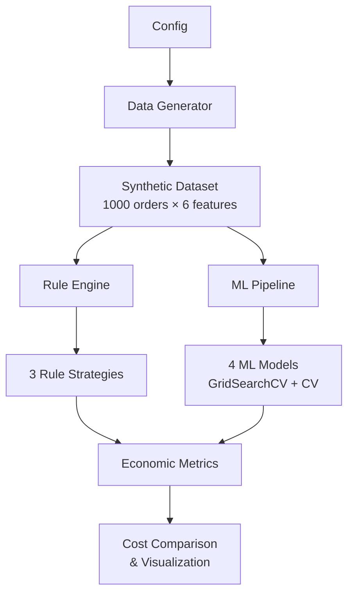

# 🔁 CODA: Cost-Optimal Decision Algorithm

[](https://python.org)
[](LICENSE)
[](#-running-tests)

> **Official repository for the paper: "CODA: Cost-Optimal Decision Algorithm for Fraud Detection in Quick-Commerce Platforms"**

---

## 📋 Overview

Online platforms make thousands of refund decisions daily. This project demonstrates that **optimizing for classification accuracy alone does not guarantee optimal economic outcomes**, by comparing:

- **3 Rule-Based Strategies** — Simple, Conservative, and Lenient heuristics
- **6 ML Models** — Logistic Regression, Random Forest, Gradient Boosting, XGBoost, LightGBM, and Cost-Sensitive Baselines (MetaCost, CS-SVM)
- **3 Datasets** — Synthetic ($N=1,000$), IEEE-CIS ($N=10,000$), and PaySim ($N=10,000$)
- **Economic Cost Function** — Models refund cost, fraud penalty, and customer retention loss

### Key Insight
> A model with higher accuracy can have **higher economic cost** than a simpler model, because accuracy treats all errors equally while the business impacts of false positives (fraudulent refunds) and false negatives (customer churn) are very different.

---

## 🏗️ Architecture



---

## 📁 Project Structure

```
refund-decision-simulator/
├── src/
│   ├── __init__.py              # Package init with public API exports
│   ├── config.py                # Centralized configuration (dataclass)
│   ├── data_generator.py        # Synthetic dataset generation
│   ├── dataset_loader.py        # 🆕 IEEE-CIS and PaySim loaders with PCA alignment
│   ├── rule_engine.py           # 3 rule-based strategies
│   ├── model.py                 # ML pipeline (6 models, GridSearchCV)
│   ├── metrics.py               # Economic cost + classification metrics
│   ├── visualization.py         # Professional dark-theme plots
│   ├── coda.py                  # 🆕 Formal CODA Algorithm (Algorithm 1) & 3-Tier Decision
│   ├── cost_sensitive_model.py  # Per-instance cost-weighted training
│   ├── threshold_optimizer.py   # Cost-optimal threshold search
│   ├── sensitivity_analysis.py  # Dynamic cost sensitivity analysis
│   ├── pareto_analysis.py       # Multi-objective Pareto front
│   └── bootstrap_validation.py  # 🆕 Statistical validation (Bootstrap resampling)
├── tests/
│   ├── __init__.py
│   ├── test_data_generator.py   # 14 tests
│   ├── test_rule_engine.py      # 16 tests
│   ├── test_model.py            # 13 tests
│   ├── test_metrics.py          # 16 tests
│   └── test_novel.py            # 🆕 20+ tests for novel contributions
├── refund_decision_simulator.ipynb   # Main notebook (10 sections)
├── research_analysis.ipynb           # 🆕 Research notebook (4 novel contributions)
├── requirements.txt
├── .gitignore
├── LICENSE
└── README.md
```

---

## 🔬 Novel Research Contributions

This project includes **6 formal contributions** aligned with the IEEE paper:

### 1. Cost-Sensitive Custom Loss Training (`src/cost_sensitive_model.py`)
Per-instance sample weights derived from the economic cost model, so models **learn to minimize cost**, not just accuracy. Unlike standard class-weight balancing, this uses instance-level economic information.

### 2. Optimal Decision Threshold Search (`src/threshold_optimizer.py`)
Sweeps decision thresholds from 0.0 to 1.0 and proves the **cost-optimal threshold ≠ 0.5**. Demonstrates that threshold selection should be driven by business objectives, not statistical convention.

### 3. The CODA Algorithm & Ablation Study (`src/coda.py`)
Unifies weighting and threshold search into a single reproducible pipeline (Algorithm 1). Includes a Three-Tier Decision Output (Auto-Approve, Manual Review, Auto-Deny) and an ablation study to validate component synergy.

### 4. Dynamic Cost Sensitivity Analysis (`src/sensitivity_analysis.py`)
Shows that the optimal strategy is **environment-dependent**:
- Varies `retention_value` (₹100 → ₹2000) and `fraud_penalty_multiplier` (1× → 5×)
- Generates 2D heatmaps showing which strategy wins in each cost regime

### 5. Multi-Dataset Validation & Pareto Analysis (`src/dataset_loader.py`, `src/pareto_analysis.py`)
Frames strategy selection as a **multi-objective optimization** problem across 3 datasets (Synthetic, IEEE-CIS, PaySim). Identifies Pareto-optimal strategies using PCA-aligned feature spaces.

### 6. Statistical Bootstrap Validation (`src/bootstrap_validation.py`)
Employs Bootstrap resampling ($B=1,000$) to calculate 95% Confidence Intervals and pairwise $p$-values, proving cost reductions are statistically significant ($p < 0.01$).

> See `research_analysis.ipynb` for the full analysis with visualizations.

---

## 🚀 Getting Started

### Prerequisites
- Python 3.10 or higher
- pip package manager

### Installation

```bash
# Clone the repository
git clone https://github.com/keshavanand2025/refund-decision-simulator.git
cd refund-decision-simulator

# Create virtual environment (recommended)
python -m venv venv
source venv/bin/activate  # Linux/Mac
venv\Scripts\activate     # Windows

# Install dependencies
pip install -r requirements.txt
```

### Running the Notebooks

```bash
# Main analysis
jupyter notebook refund_decision_simulator.ipynb

# Research contributions
jupyter notebook research_analysis.ipynb
```

---

## 🧪 Running Tests

```bash
# Run all tests with verbose output
python -m pytest tests/ -v

# Run with coverage (if pytest-cov installed)
python -m pytest tests/ -v --cov=src
```

---

## 📊 Methodology

### Data Generation & Loading
- **Synthetic Dataset** ($N=1,000$): Generated with 5 features:
  - `order_amount` (₹100–₹2000)
  - `delay_minutes` (0–90 min)
  - `previous_refunds` (0–10)
  - `fraud_score` (0.0–1.0)
  - `complaint_severity` (1–5)
- **Real-World Datasets**:
  - **IEEE-CIS** ($N=10,000$, 3.5% fraud)
  - **PaySim** ($N=10,000$, 0.13% fraud)
  - Both datasets are aligned to the 5-feature space using **PCA** (capturing >70% variance).

### Rule-Based Strategies

| Strategy | Bias | Key Logic |
|----------|------|-----------|
| **Simple** | Balanced | delay > 30 → approve; refunds > 3 → reject |
| **Conservative** | Reject-biased | fraud > 0.5 → reject; strict thresholds |
| **Lenient** | Approve-biased | Only fraud > 0.8 → reject; low thresholds |

### ML Models

| Model | Tuning |
|-------|--------|
| Logistic Regression | C, solver |
| Random Forest | n_estimators, max_depth, min_samples_split |
| Gradient Boosting | n_estimators, learning_rate, max_depth |
| XGBoost | n_estimators, learning_rate, max_depth |
| LightGBM | State-of-the-art cost performer |
| MetaCost & CS-SVM | Established cost-sensitive baselines |

All models use **StandardScaler**, **5-fold cross-validation**, and **GridSearchCV**.

### Economic Cost Model

| Scenario | Cost |
|----------|------|
| Approve refund | `order_amount` |
| Approve fraudulent refund | `order_amount × 2.0` |
| Deny legitimate refund | `₹500` (retention loss) |

---

## 📈 Evaluation Metrics

- **Classification**: Accuracy, Precision, Recall, F1, AUC-ROC
- **Economic**: Total cost, refund cost, fraud penalty, retention loss
- **Visualization**: Confusion matrices, ROC curves, feature importance, cost breakdown, Pareto fronts, sensitivity heatmaps

---

## 🔑 Core Concepts Demonstrated

- **Cost-Sensitive Decision Making** — Not all errors are equal
- **Decision Systems Engineering** — Rule-based vs learned approaches
- **Economic Optimization vs Accuracy Optimization** — Different objectives, different winners
- **Multi-Objective Optimization** — Pareto front analysis for tradeoff-aware decisions
- **Threshold Engineering** — Optimal probability cutoffs for cost minimization
- **Sensitivity Analysis** — Environment-dependent strategy selection
- **Simulation-Based Experimental Design** — Controlled synthetic environment
- **ML Engineering Best Practices** — Modular code, type hints, tests, reproducibility

---

## ⚠️ Limitations

- Synthetic dataset (simulated environment, not real-world)
- Static cost assumptions per run (addressed by sensitivity analysis)
- No temporal dynamics (fraud patterns evolve)
- Limited feature set (real systems use 50+ features)

---

## 🔮 Future Work

- [x] ~~Implement cost-sensitive learning with custom loss functions~~
- [x] ~~Add probability threshold optimization~~
- [x] ~~Pareto front multi-objective analysis~~
- [x] ~~Dynamic cost sensitivity analysis~~
- [x] ~~Test with real-world anonymized datasets (IEEE-CIS, PaySim)~~
- [x] ~~Formal algorithm & ablation study (CODA)~~
- [ ] Build a real-time decision REST API
- [ ] Add A/B testing simulation framework
- [ ] Implement temporal drift analysis

---

## 📄 License

This project is licensed under the MIT License — see the [LICENSE](LICENSE) file.

---

## 👤 Author

**Keshav Anand** — [@keshavanand2025](https://github.com/keshavanand2025)
