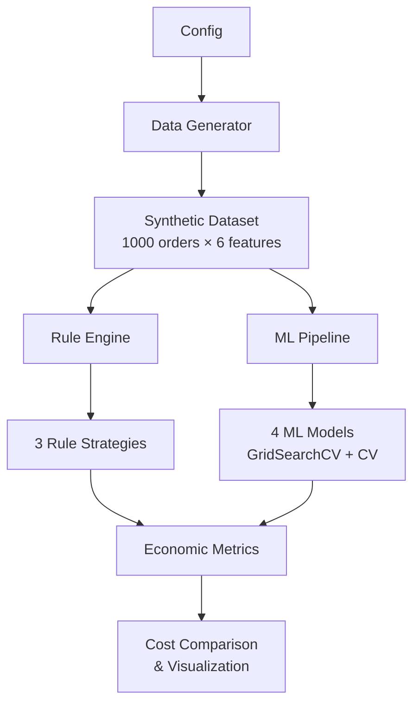

# 🔁 Refund Decision Simulator

[](https://python.org)
[](LICENSE)
[](#-running-tests)

> **Simulation comparing rule-based vs ML refund decision systems with economic cost evaluation.**

---

## 📋 Overview

Online platforms make thousands of refund decisions daily. This project demonstrates that **optimizing for classification accuracy alone does not guarantee optimal economic outcomes**, by comparing:

- **3 Rule-Based Strategies** — Simple, Conservative, and Lenient heuristics
- **4 ML Models** — Logistic Regression, Random Forest, Gradient Boosting, XGBoost
- **Economic Cost Function** — Models refund cost, fraud penalty, and customer retention loss

### Key Insight
> A model with higher accuracy can have **higher economic cost** than a simpler model, because accuracy treats all errors equally while the business impacts of false positives (fraudulent refunds) and false negatives (customer churn) are very different.

---

## 🏗️ Architecture



---

## 📁 Project Structure

```
refund-decision-simulator/
├── src/
│   ├── __init__.py            # Package init with public API exports
│   ├── config.py              # Centralized configuration (dataclass)
│   ├── data_generator.py      # Synthetic dataset generation
│   ├── rule_engine.py         # 3 rule-based strategies
│   ├── model.py               # ML pipeline (4 models, GridSearchCV)
│   ├── metrics.py             # Economic cost + classification metrics
│   └── visualization.py       # Professional dark-theme plots
├── tests/
│   ├── __init__.py
│   ├── test_data_generator.py # 14 tests
│   ├── test_rule_engine.py    # 16 tests
│   ├── test_model.py          # 13 tests
│   └── test_metrics.py        # 12 tests
├── refund_decision_simulator.ipynb  # Main notebook (10 sections)
├── requirements.txt           # Pinned dependencies
├── .gitignore
├── LICENSE
└── README.md
```

---

## 🚀 Getting Started

### Prerequisites
- Python 3.10 or higher
- pip package manager

### Installation

```bash
# Clone the repository
git clone https://github.com/keshavanand2025/refund-decision-simulator.git
cd refund-decision-simulator

# Create virtual environment (recommended)
python -m venv venv
source venv/bin/activate  # Linux/Mac
venv\Scripts\activate     # Windows

# Install dependencies
pip install -r requirements.txt
```

### Running the Notebook

```bash
jupyter notebook refund_decision_simulator.ipynb
```

Or run in Google Colab by uploading the notebook and `src/` directory.

---

## 🧪 Running Tests

```bash
# Run all tests with verbose output
python -m pytest tests/ -v

# Run with coverage (if pytest-cov installed)
python -m pytest tests/ -v --cov=src
```

---

## 📊 Methodology

### Data Generation
- **1000 synthetic orders** with 5 features:
  - `order_amount` (₹100–₹2000)
  - `delay_minutes` (0–90 min)
  - `previous_refunds` (0–4)
  - `fraud_score` (0.0–1.0)
  - `complaint_severity` (1–5)
- Target label generated via **sigmoid** over weighted feature combination

### Rule-Based Strategies

| Strategy | Bias | Key Logic |
|----------|------|-----------|
| **Simple** | Balanced | delay > 30 → approve; refunds > 3 → reject |
| **Conservative** | Reject-biased | fraud > 0.5 → reject; strict thresholds |
| **Lenient** | Approve-biased | Only fraud > 0.8 → reject; low thresholds |

### ML Models

| Model | Tuning |
|-------|--------|
| Logistic Regression | C, solver |
| Random Forest | n_estimators, max_depth, min_samples_split |
| Gradient Boosting | n_estimators, learning_rate, max_depth |
| XGBoost | n_estimators, learning_rate, max_depth |

All models use **StandardScaler**, **5-fold cross-validation**, and **GridSearchCV**.

### Economic Cost Model

| Scenario | Cost |
|----------|------|
| Approve refund | `order_amount` |
| Approve fraudulent refund | `order_amount × 2.0` |
| Deny legitimate refund | `₹500` (retention loss) |

---

## 📈 Evaluation Metrics

- **Classification**: Accuracy, Precision, Recall, F1, AUC-ROC
- **Economic**: Total cost, refund cost, fraud penalty, retention loss
- **Visualization**: Confusion matrices, ROC curves, feature importance, cost breakdown

---

## 🔑 Core Concepts Demonstrated

- **Cost-Sensitive Decision Making** — Not all errors are equal
- **Decision Systems Engineering** — Rule-based vs learned approaches
- **Economic Optimization vs Accuracy Optimization** — Different objectives, different winners
- **Simulation-Based Experimental Design** — Controlled synthetic environment
- **ML Engineering Best Practices** — Modular code, type hints, tests, reproducibility

---

## ⚠️ Limitations

- Synthetic dataset (simulated environment, not real-world)
- Static cost assumptions (real costs vary by segment)
- No temporal dynamics (fraud patterns evolve)
- Limited feature set (real systems use 50+ features)

---

## 🔮 Future Work

- [ ] Implement cost-sensitive learning with custom loss functions
- [ ] Add probability threshold optimization
- [ ] Test with real-world anonymized datasets
- [ ] Build a real-time decision REST API
- [ ] Add A/B testing simulation framework

---

## 📄 License

This project is licensed under the MIT License — see the [LICENSE](LICENSE) file.

---

## 👤 Author

**Keshav Anand** — [@keshavanand2025](https://github.com/keshavanand2025)
