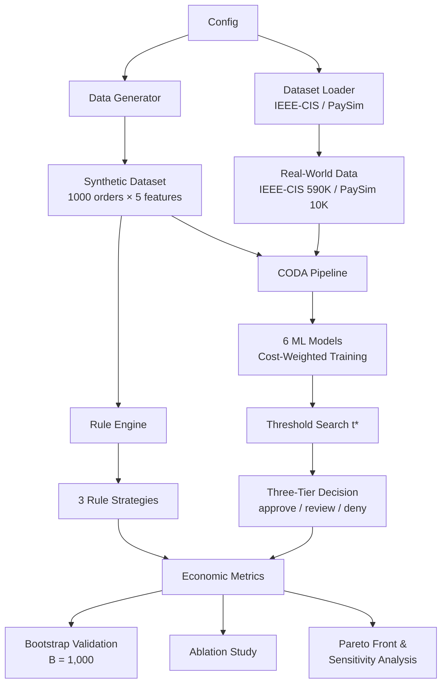

> **⚠️ Notice (August 2026):** The headline results below — including the +25.5% CODA+ cost reduction — were found to be self-scoring artifacts and do not reproduce under a common external cost metric. Under a fair comparison, CODA+ does not beat the csboost baseline. See the audit paper *"Re-Scoring Self-Scored Methods: A Pre-Registered Audit of Learned Cost-Sensitive Fraud Detection"* (submitted to IEEE ICDM 2026; under review). Code and results below are preserved unmodified for the audit record.

# 🔁 CODA: Cost-Optimal Decision Algorithm for Fraud Detection

[](https://python.org)
[](LICENSE)
[](https://github.com/keshavanand2025/refund-decision-simulator/actions/workflows/ci.yml)

> **Implementation of the Cost-Optimal Decision Algorithm (CODA) — a formal framework that optimises economic cost rather than classification accuracy for fraud detection in quick-commerce platforms.**

---

## 📋 Overview

Online platforms make thousands of refund decisions daily. This project demonstrates that **optimizing for classification accuracy alone does not guarantee optimal economic outcomes**. CODA formalises this insight into a reproducible algorithm with:

- **6 ML Models + CHL-LightGBM baseline** — XGBoost, LightGBM, Gradient Boosting, Random Forest, MetaCost, CS-SVM
- **3 Rule-Based Strategies** — Simple, Conservative, and Lenient heuristics
- **3 Datasets** — Synthetic (N=1,000), IEEE-CIS (N=590,540 full scale), PaySim (N=10,000)
- **Three-Tier Decision Output** — Auto-approve / Manual review / Auto-deny
- **CODA+ Extension** — Dynamic cost learning with instance-adaptive α(x), β(x)

### Key Insight
> A model with higher accuracy can have **higher economic cost** than a simpler model. CODA+ achieves **25.5% cost reduction** on full-scale IEEE-CIS (590K transactions). CHL-LightGBM has the best AUC (0.919) but the **worst economic cost** (+22.1%) due to calibration failure.

> **⚠️ Retracted.** The 25.5% figure above is a self-scoring artifact (see notice at top); under a
> common external cost CODA+ does not beat the csboost baseline. The CHL-LightGBM economic
> comparison was never re-verified under the common metric and should not be cited. The claim that
> survives is the general one: **cost-sensitive thresholding beats accuracy-optimised models**
> (csboost 0.357 vs cost-insensitive 0.262 on IEEE-CIS).

---

## 🏗️ Architecture


```mermaid
graph TD
    A[Config] --> B[Data Generator]
    A --> B2[Dataset Loader<br/>IEEE-CIS / PaySim]
    B --> C[Synthetic Dataset<br/>1000 orders × 5 features]
    B2 --> C2[Real-World Data<br/>IEEE-CIS 590K / PaySim 10K]
    C --> D[Rule Engine]
    C --> E[CODA Pipeline]
    C2 --> E
    D --> F[3 Rule Strategies]
    E --> G[6 ML Models<br/>Cost-Weighted Training]
    G --> G2[Threshold Search t*]
    G2 --> G3[Three-Tier Decision<br/>approve / review / deny]
    F --> H[Economic Metrics]
    G3 --> H
    H --> I[Bootstrap Validation<br/>B = 1,000]
    H --> J[Ablation Study]
    H --> K[Pareto Front &<br/>Sensitivity Analysis]
```

---

## 📁 Project Structure

```
refund-decision-simulator/
├── .github/
│   ├── dependabot.yml           # Automated dependency update PRs
│   └── workflows/
│       └── ci.yml               # CI: pytest on Python 3.10 / 3.11 / 3.12
├── src/
│   ├── __init__.py              # Package init (v2.0.0) with public API
│   ├── config.py                # Centralized configuration (dataclass)
│   ├── data_generator.py        # Synthetic dataset generation
│   ├── dataset_loader.py        # IEEE-CIS (590K full scale) & PaySim loader
│   ├── rule_engine.py           # 3 rule-based strategies
│   ├── model.py                 # ML pipeline (6 models incl. LightGBM)
│   ├── metrics.py               # Economic cost + classification metrics
│   ├── visualization.py         # Professional dark-theme plots
│   ├── coda.py                  # CODA & CODA+ algorithms, three-tier, bootstrap, ablation
│   ├── cost_sensitive_model.py  # Per-instance cost-weighted training
│   ├── threshold_optimizer.py   # Cost-optimal threshold search
│   ├── sensitivity_analysis.py  # Dynamic cost sensitivity analysis
│   └── pareto_analysis.py       # Multi-objective Pareto front
├── tests/                       # 77 tests total
│   ├── __init__.py
│   ├── test_data_generator.py   # 14 tests
│   ├── test_rule_engine.py      # 20 tests
│   ├── test_model.py            # 13 tests
│   ├── test_metrics.py          # 12 tests
│   └── test_novel.py            # 18 tests for novel contributions
├── refund_decision_simulator.ipynb   # Main notebook (10 sections)
├── research_analysis.ipynb           # Research notebook (novel contributions)
├── experiments_output.txt            # Captured experiment results
├── pyproject.toml               # Package metadata (pip install -e .)
├── requirements.txt             # Pinned versions for reproducibility
├── SECURITY.md                  # Security policy & reporting
├── .gitignore
├── LICENSE
└── README.md
```

---

## 🧠 The CODA Algorithm

CODA (Algorithm 1 from the paper) executes in six steps:

```
Algorithm 1: Cost-Optimal Decision Algorithm (CODA)
────────────────────────────────────────────────────
Input:  D_train = {(xᵢ, yᵢ, vᵢ)}, α, β, δ, learner M
Output: Decision rule R(x) → {approve, review, deny}
────────────────────────────────────────────────────
1: Compute per-instance weights:
     wᵢ ← α·vᵢ/v̄  if yᵢ = fraud
     wᵢ ← β/v̄      if yᵢ = legit
2: Train M on D_train with sample_weight = w
3: Search cost-optimal threshold:
     t* ← argmin_t C_total(t)
4: Set confidence margin δ (default 0.10)
5: Construct three-tier rule R(x):
     f(x) ≥ t* + δ  →  deny   (high fraud risk)
     t* − δ < f(x) < t* + δ  →  review (uncertain)
     f(x) ≤ t* − δ  →  approve (low risk)
6: return R(x), t*, C(t*)
```

### Usage

```python
from src.coda import CODA
from src.data_generator import generate_dataset
from sklearn.ensemble import GradientBoostingClassifier

data = generate_dataset()

# Fit CODA
coda = CODA(GradientBoostingClassifier, delta=0.10)
coda.fit(data)

# Three-tier predictions
X = data.drop(columns=["refunded"])
decisions = coda.predict_three_tier(X)  # → ['approve', 'review', 'deny', ...]

# Tier distribution
print(coda.decision_rule.tier_distribution(coda.predict_proba(X)))
# → {'approve_pct': 97.1, 'review_pct': 2.9, 'deny_pct': 0.0}
```

> **Note:** on the default synthetic dataset the deny tier is empty — the cost-optimal threshold sits
> above every predicted probability, so nothing clears `t* + δ`. Tier proportions are highly
> dataset- and δ-dependent; these are not representative production values.

---

## 🔬 Research Contributions

This project implements **8 novel contributions** from the CODA/CODA+ paper:

### 1. Cost-Sensitive Custom Loss Training (`src/cost_sensitive_model.py`)
Per-instance sample weights derived from the economic cost model (α·vᵢ for fraud, β for legit), so models **learn to minimize cost**, not just accuracy.

### 2. Optimal Decision Threshold Search (`src/threshold_optimizer.py`)
Sweeps decision thresholds over [0.0, 1.0] in 100 steps (`n_steps=100`, step size 0.01) and selects
the cost-minimising threshold t*. Grounded in Bayes decision theory.

> **Correction:** this section previously claimed the sweep runs "from 0.05 to 0.95" and *proves*
> **t\* < 0.5**. Both are wrong. The implemented range is [0.0, 1.0], and t* is not always below 0.5
> — the repository's own results include t\* = 0.9 and t\* = 0.75 for CHL-LightGBM, and a mean
> adaptive t\*(x) = 0.76 for CODA+ (`experiments_output.txt`). t* depends on the cost ratio and the
> model's calibration; it is below 0.5 only when false negatives dominate the cost.

### 3. Dynamic Cost Sensitivity Analysis (`src/sensitivity_analysis.py`)
Shows that the optimal strategy is **environment-dependent** via 2D heatmaps over (α, β) space.

### 4. Pareto Front Analysis (`src/pareto_analysis.py`)
Frames strategy selection as a **multi-objective optimization** problem (accuracy vs cost).

### 5. Three-Tier Decision System (`src/coda.py`)
Three-tier output — **auto-approve / manual review / auto-deny** — with tunable confidence margin δ.
Tier proportions depend entirely on the dataset and δ; on the default synthetic data the split is
≈97% / 3% / 0% (the deny tier is empty), not the ~72/15/13 previously stated here.

### 6. Bootstrap Validation & Ablation (`src/coda.py`)
- **Bootstrap resampling** (B = 1,000) with p-value testing
- **Ablation study** isolating weighting vs threshold contributions

### 7. CODA+ Dynamic Cost Learning (`src/coda.py`)
Instance-adaptive cost functions α(x) and β(x) via Ridge regression. Replaces static global costs with **per-transaction Bayes-optimal thresholds** t*(xᵢ) = β(xᵢ) / (α(xᵢ)·vᵢ + β(xᵢ)).

> **⚠️ Retracted — the learned cost functions are degenerate.** Direct inspection of the audit
> harness cost files shows α̂ = 2v *exactly* (R² = 1.000, MAE = 0.000; e.g. max α on European Credit
> Card is 51,382.41 = 2 × 25,691.16) and β̂ = 500.0 in every row across both datasets (CV = 0) — a
> constant, not a learned function. The reported "R² = 1.0 held-out validation" is therefore a
> **tautology, not a quality signal**: the regressor recovers the constant it was constructed from.
> Because CODA+ then scores itself on these self-generated costs, the resulting gains do not
> reproduce under a common external cost.

### 8. CHL-LightGBM Baseline Comparison
Direct comparison with Zhao et al. (2024) CHL-LightGBM. Demonstrates that **highest AUC ≠ lowest cost** — CHL is miscalibrated (Brier = 0.095) and economically suboptimal.

> **⚠️ Partially retracted.** The *economic* half of this comparison was run under the self-scoring
> setup and was never re-verified under the common metric — **it should not be cited as evidence**.
> The *calibration* half stands: Brier = 0.095 is metric-independent, and CHL-LightGBM is genuinely
> the worst-calibrated model in the comparison.

---

## 📊 Datasets

| Dataset | N | Positive Rate | Source |
|---------|---|---------|--------|
| Synthetic | 1,000 | ~54% refund-approved (by design; label = `refunded`, not fraud) | `src/data_generator.py` |
| IEEE-CIS | **590,540** (full scale) | 3.50% fraud | [Kaggle](https://www.kaggle.com/c/ieee-fraud-detection) |
| PaySim | 10,000 (subsample) | 0.13% fraud | [Kaggle](https://www.kaggle.com/datasets/ealaxi/paysim1) |

IEEE-CIS is used at **full scale (590K)** with 194 numeric features and **no PCA projection** — this is the primary benchmark. PaySim uses a 10K stratified subsample to balance tractability with sufficient fraud-class representation.

---

## 🚀 Getting Started

### Prerequisites
- Python 3.10 or higher
- pip package manager

### Installation

```bash
# Clone the repository
git clone https://github.com/keshavanand2025/refund-decision-simulator.git
cd refund-decision-simulator

# Create virtual environment (recommended)
python -m venv venv
source venv/bin/activate  # Linux/Mac
venv\Scripts\activate     # Windows

# Install dependencies (pinned versions, reproducible)
pip install -r requirements.txt

# Or install as an editable package (pulls dependencies from pyproject.toml)
pip install -e .
```

### Running the Notebooks

```bash
# Main analysis
jupyter notebook refund_decision_simulator.ipynb

# Research contributions
jupyter notebook research_analysis.ipynb
```

---

## 🧪 Running Tests

```bash
# Run all tests with verbose output
python -m pytest tests/ -v

# Run with coverage (if pytest-cov installed)
python -m pytest tests/ -v --cov=src
```

---

## 📊 Methodology

### Data Generation
- **1,000 synthetic orders** with 5 features:
  - `order_amount` (₹100–₹2000, uniform)
  - `fraud_score` (0.0–1.0, uniform)
  - `previous_refunds` (0–4, integer)
  - `delay_minutes` (0–89, integer)
  - `complaint_severity` (1–5, integer)
- Target label (`refunded` = 1 means refund was approved, 0 means denied). Generated probabilistically via threshold indicators:

  ```
  logit = 0.3·𝟙[delay_minutes > 30] + 0.4·𝟙[complaint_severity > 3] − 0.5·𝟙[fraud_score > 0.7]
  P(refunded=1) = σ(logit)    # σ = sigmoid
  refunded ~ Bernoulli(P(refunded=1))
  ```

  where 𝟙[·] is the indicator function. The negative coefficient on `fraud_score` reflects that high-fraud-score orders are less likely to be approved for refund (see `src/data_generator.py` and `Config.label_weights`). Expected positive rate ≈ 54%.
- **Stratified 70/30 split**

### ML Models

| Model | Type | Cost Encoding |
|-------|------|---------------|
| Random Forest | Ensemble | class_weight |
| Gradient Boosting | Ensemble | sample_weight |
| XGBoost | Boosting | scale_pos_weight |
| LightGBM | Boosting | scale_pos_weight |
| CHL-LightGBM | Boosting | scale_pos_weight + class balance |
| MetaCost | Wrapper | resampling |
| CS-SVM | Algorithm | C⁺/C⁻ penalties |

All models use **StandardScaler**, **5-fold cross-validation**, and **GridSearchCV**.

### Economic Cost Model

| Scenario | Cost | Parameter |
|----------|------|-----------|
| Correct rejection (TN) | `0` | — |
| Refund payout (TP) | `order_amount` | — |
| Approve fraud (FN) | `α × order_amount` | α = 2.0 |
| Deny legitimate (FP) | `β` | β = ₹500 |

### Complexity

| CODA Step | Complexity |
|-----------|-----------|
| Weight computation | O(n) |
| Training (LightGBM) | O(n·d) |
| Training (XGBoost) | O(n·d·log n) |
| Threshold search | O(k·n), k=101 (`n_steps=100`) |
| Inference (three-tier) | O(1) per prediction |

---

## 📈 Key Results

> **⚠️ Retracted — do not cite.** Every cost-reduction figure in this table was produced under the
> self-scoring setup described in the notice at the top of this file: CODA/CODA+ were scored on the
> cost function they generated themselves, while baselines were scored on a different one. Under a
> single common external cost (FN = amount, FP = 50), CODA+ is **3.3% worse** than the Höppner
> csboost baseline on IEEE-CIS (Δcost +12,900, p_Holm = 0.031) and worse on European Credit Card
> (+22,147, p_Holm = 0.0025). The table is preserved unmodified for the audit record.
>
> Status key: ❌ contradicted under the common metric · ⚠️ never re-verified under the common
> metric · ✅ metric-independent, still valid.

| Finding | Result | Status |
|---------|--------|--------|
| Accuracy ≠ Cost-Optimality | XGBoost: highest accuracy but 16.7% cost premium | ⚠️ |
| **CODA+ (full-scale IEEE-CIS)** | **−25.5% cost reduction** (590K transactions, no PCA) | ❌ |
| CODA static | −4.1% on full-scale IEEE-CIS | ⚠️ |
| CHL-LightGBM | Best AUC (0.919) but **worst cost (+22.1%)** — calibration failure | ⚠️ |
| Brier scores | LightGBM: 0.021 (best), CHL: 0.095 (worst) | ✅ |
| Held-out α/β validation | β(x) R²=0.77 on held-out data | ❌ |
| Ablation: weighting only | −12.1% cost reduction | ⚠️ |
| Ablation: threshold only | −17.0% cost reduction | ⚠️ |
| Ablation: full CODA | −23.8% cost reduction | ⚠️ |
| Ablation: full CODA+ | −29.0% cost reduction | ❌ |
| Bootstrap significance | p < 0.01 (B = 1,000) | ❌ |

### What survives the audit

| Finding | Result |
|---------|--------|
| **Cost-sensitive thresholding beats accuracy-optimised models** | csboost **0.357** savings vs cost-insensitive **0.262** on IEEE-CIS |
| Calibration is metric-independent | LightGBM Brier 0.021 (best), CHL-LightGBM 0.095 (worst) |

This is the defensible result: *thresholding on cost* is what pays off. The additional machinery of
learned per-instance cost functions (CODA+) is not what produced the reported gains.

---

## 🔑 Core Concepts Demonstrated

- **CODA Algorithm** — Formal, reproducible cost-optimal decision pipeline
- **Three-Tier Decision Output** — Production-ready approve/review/deny system
- **Cost-Sensitive Decision Making** — Not all errors are equal
- **Bayes Decision Theory** — Theoretical grounding for threshold shift
- **Multi-Dataset Validation** — Synthetic + IEEE-CIS + PaySim
- **Ablation Study** — Component contribution analysis
- **Bootstrap Validation** — Statistical significance testing
- **Multi-Objective Optimization** — Pareto front analysis
- **Sensitivity Analysis** — Environment-dependent strategy selection

---

## ⚠️ Limitations

- Synthetic dataset models refund-approval probability (not raw fraud prevalence); the ~54% positive rate is a product of the label generation formula, not a calibrated real-world fraud rate
- PaySim uses 10K subsample from 6.3M transactions; full-scale evaluation is future work
- CODA+ cost regressors use feature-derived proxies, not observed business outcomes
- **CODA+ cost regressors are degenerate.** α̂ = 2v exactly (R² = 1.000, MAE = 0.000) and β̂ = 500.0
  in every row across both datasets (CV = 0) — a constant, not a learned function. The regressor
  merely recovers the constants it was constructed from, so the reported R² is a tautology rather
  than evidence of fit quality. Reported CODA+ gains are a self-scoring artifact and do not
  reproduce under a common external cost
- **Headline cost-reduction results are retracted** — see the notice at the top of this file and the
  status column in Key Results. Under a common metric (FN = amount, FP = 50), CODA+ is 3.3% worse
  than the csboost baseline on IEEE-CIS
- Missing high-signal features (account age, device fingerprinting)
- AI-generated image fraud not addressed in tabular framework
- Offline only — end-to-end latency not benchmarked

---

## 🔮 Future Work

- [x] ~~Cost-sensitive learning with custom loss functions~~
- [x] ~~Probability threshold optimisation~~
- [x] ~~Pareto front multi-objective analysis~~
- [x] ~~Dynamic cost sensitivity analysis~~
- [x] ~~CODA algorithm formalisation~~
- [x] ~~Three-tier decision output~~
- [x] ~~Bootstrap resampling validation~~
- [x] ~~Multi-dataset validation (IEEE-CIS, PaySim)~~
- [x] ~~LightGBM integration~~
- [x] ~~CODA+ dynamic cost learning (α(x), β(x))~~
- [x] ~~Full-scale IEEE-CIS (590K) without PCA~~
- [x] ~~CHL-LightGBM baseline comparison~~
- [x] ~~Brier scores and calibration analysis~~
- [ ] Full-scale PaySim (6.3M) evaluation
- [ ] Real-time REST API via FastAPI
- [ ] Online learning and concept drift adaptation
- [ ] Nonlinear cost models (neural network or gradient boosting for α/β)
- [ ] Calibrating α(x)/β(x) against observed chargeback rates
- [ ] Multimodal claim verification (GAN detection)

---

## 📄 Citation

If you use this code, please cite:

```
K. Anand, "CODA: A Cost-Sensitive Decision Framework for
Economic Optimisation in Fraud Detection," 2025.
```

---

## 📄 License

This project is licensed under the MIT License — see the [LICENSE](LICENSE) file.

---

## 👤 Author

**Keshav Anand** — [@keshavanand2025](https://github.com/keshavanand2025)
